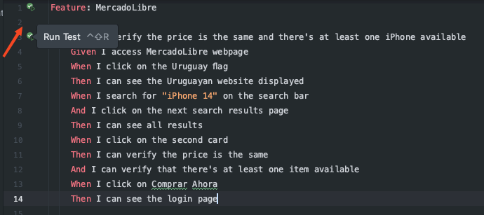

# AutomatedTest

Este proyecto contiene pruebas automatizadas para la plataforma MercadoLibre utilizando Selenium, Cucumber y Java. 

## Instalación de Dependencias 

Antes de ejecutar las pruebas, se deben de tener todas las dependencias necesarias instaladas. Se puede hacer de las siguientes maneras:

### Opción 1 

1. Abriendo una terminal y navegando hasta la raíz del proyecto. 
2. Ejecutando el siguiente comando para descargar y configurar todas las dependencias de Maven: ```mvn clean install -U```

### Opción 2

Haciendo click al ícono de Maven que aparece a la derecha de la ventana. 


### Opción 3

Yendo al archivo ```pom.xml``` y haciendo click en el ícono que aparece de Maven en la esquina superior derecha.


## Ejecución de las Pruebas

1. Una vez que todas las dependencias estén instaladas, se pueden ejecutar las pruebas. Las pruebas se encuentran en el archivo `MercadoLibre.feature` que está ubicado en la siguiente ruta: ```src/main/resources/features/MercadoLibre.feature```.

2. Hacer click en cualquiera de los dos botones de "play" en el Feature (si hubieran más escenarios, darle play en Feature permitiría correr todos los escenarios seguidos sin interrupciones) o directamente en el escenario que quiero correr:

   

